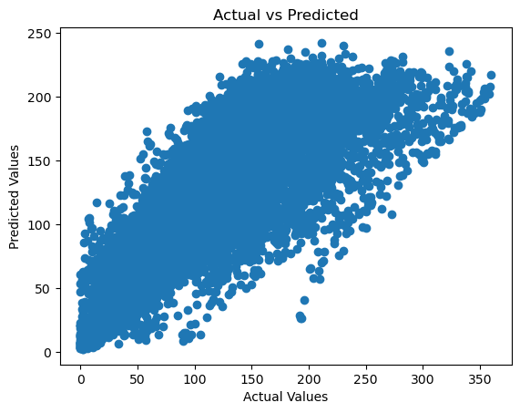
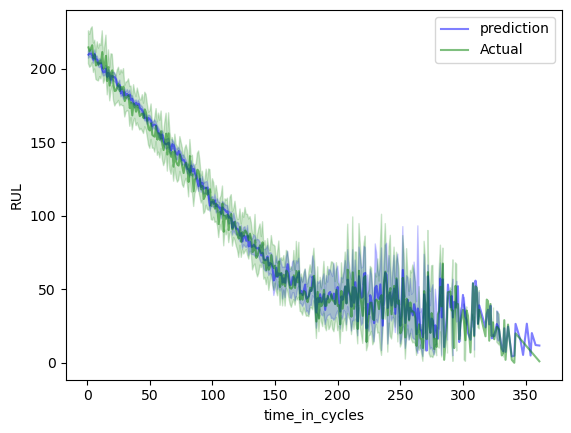
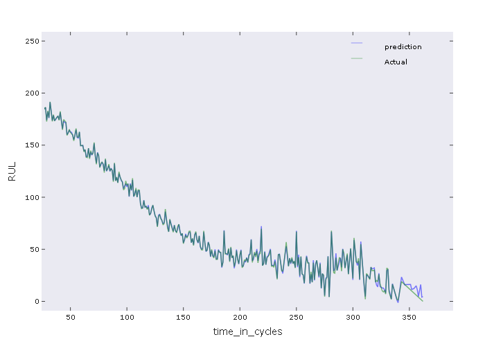
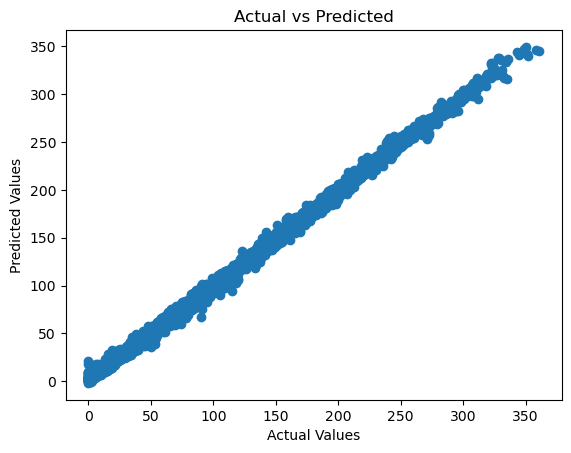

# NASA RUL Prediction

Machine learning models for predicting Remaining Useful Life (RUL) on the NASA C-MAPSS turbofan degradation dataset.  
Achieved **RMSE: 2.79**, demonstrating top-tier performance on this benchmark.

Made for a presentation to illustrate python and machine learning with test data. 


https://data.nasa.gov/Aerospace/CMAPSS-Jet-Engine-Simulated-Data/ff5v-kuh6/about_data
***
---

## ✨ Features
- Preprocessing pipeline for time-series sensor data
- Feature engineering (statistical, temporal, and degradation trends)
- Implementation of regression models and ensembles
- Training/validation splits aligned with NASA data structure
- Performance metric: Root Mean Squared Error (RMSE)

---

## 🛠 Tools & Libraries
- Python 3.8
- pandas, numpy, scikit-learn
- matplotlib, plotly, seaborn (visualization)
- jupyter (tutorials & exploration)

---

## 📊 Results
- Final model: Ensemble regressor
- Test RMSE: **2.79**
- Outperforms common baselines and demonstrates robustness across multiple engine units
---
## Initial Baseline Run
- Baseline Run before feature engineering




---
### Final Run with Ensemble Method
- Final run with ensemble method and feature engineering and RMSE of 2.79




---

### Bonus: Plotly Plot inside PySide GUI

First time putting an interactive plot in a GUI. Have improved my methods greatly since.

Click to play 👇


---

## 🚀 How to Run
Clone the repo and install dependencies:

```bash
git clone https://github.com/ratrent55/NASA_RUL.git
conda env create -f environment.yml
